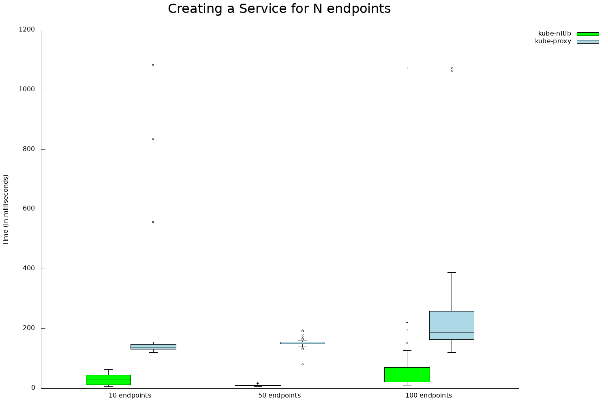
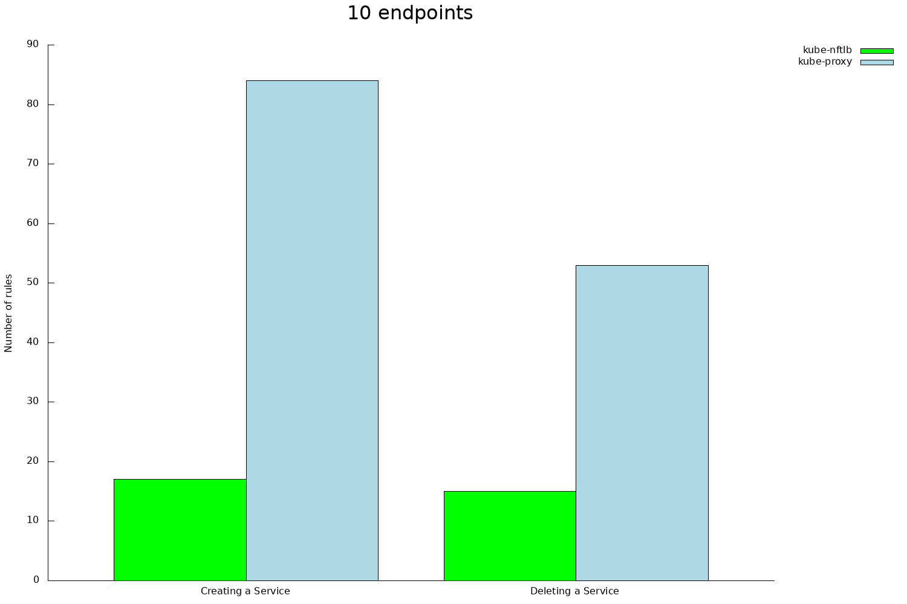
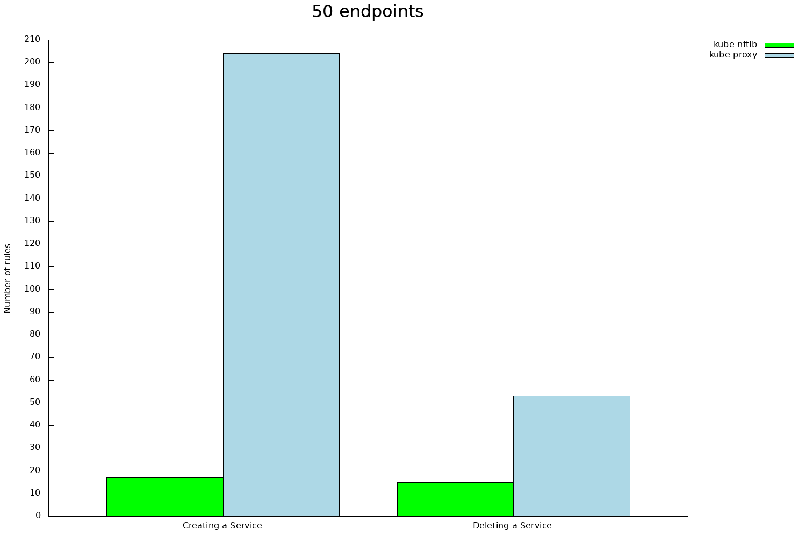
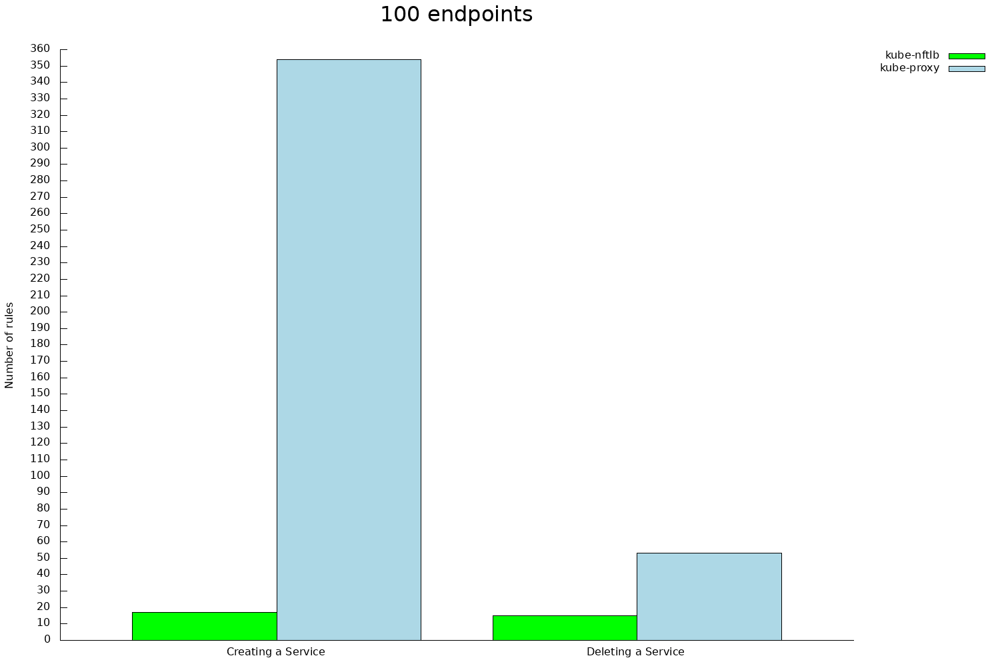

- [kube-nftlb](#kube-nftlb)
  - [Features 🌟](#features-)
  - [Prerequisites 📋](#prerequisites-)
  - [Installation 🔧](#installation-)
  - [Deployment 🚀](#deployment-)
  - [Host settings ⚙](#host-settings-)
  - [Creating resources ✏](#creating-resources-)
    - [Service](#service)
    - [Deployment](#deployment)
  - [Setting up annotations for a Service 📌](#setting-up-annotations-for-a-service-)
    - [How to set up annotations](#how-to-set-up-annotations)
    - [Mode](#mode)
    - [Persistence](#persistence)
    - [Scheduler](#scheduler)
    - [Helper](#helper)
    - [Log](#log)
  - [Benchmarks 📊](#benchmarks-)
    - [Environment](#environment)
    - [Summary](#summary)
    - [Comparison of averages](#comparison-of-averages)
    - [Charts: time by endpoints number](#charts-time-by-endpoints-number)
    - [Charts: rules by count type](#charts-rules-by-count-type)

# kube-nftlb

[](https://pkg.go.dev/github.com/zevenet/kube-nftlb?tab=overview)
[](https://goreportcard.com/report/github.com/zevenet/kube-nftlb)


`kube-nftlb` is a Kubernetes Daemonset able to communicate the Kubernetes API Server, based on a Debian Buster image with [`nftlb`](https://github.com/zevenet/nftlb) installed.

It can request information from the API Server such as new, updated or deleted Services/Endpoints, and make rules in `nftables` accordingly.

## Features 🌟

- ✅ `nftables` backend, the new packet classification framework that replaces the existing {ip,ip6,arp,eb}_tables infrastructure.
- ✅ Support for Services and Endpoints.
- ✅ Annotations can be used to configure Services.
- ✅ Functional and performance tests.
- ⏹ _(Coming soon)_ Support for Network Policies.

## Prerequisites 📋

* Docker
* Minikube
* `kubectl`
* `nftables`
* `libnftnl11`
* `conntrack`

Also, you can run `debian_tools_installer.sh` **as root** after a fresh Debian Buster install.

```console
root@debian:kube-nftlb# ./debian_tools_installer.sh
```

## Installation 🔧

```console
# Clone the project
user@debian:~# git clone https://github.com/zevenet/kube-nftlb

# Change directory
user@debian:~# cd kube-nftlb
```

**For development:**

```console
# Copy and rename .env.example to .env
user@debian:kube-nftlb# cp .env.example .env

# Generate a random password for nftlb
user@debian:kube-nftlb# NFTLB_KEY=$(base64 -w 32 /dev/urandom | tr -d /+ | head -n 1) ; sed -i "s/^NFTLB_KEY=.*$/NFTLB_KEY=$NFTLB_KEY/" .env

# Change user to root
user@debian:kube-nftlb# su

# Modify scripts permissions to grant root execute access
root@debian:kube-nftlb# chmod +x *.sh

# Build the Docker image with build.sh (prerequisites must be met before this)
root@debian:kube-nftlb# ./build.sh
```

## Deployment 🚀

1. Start Minikube without `kube-proxy` being deployed by default:
```console
root@debian:kube-nftlb# minikube start --vm-driver=none --extra-config=kubeadm.skip-phases=addon/kube-proxy
```

2. The cluster needs to apply some settings, and they are inside `yaml/`. `coredns` will be able to resolve external hostnames and `kube-nftlb` will be deployed after running this command:

```console
root@debian:kube-nftlb# kubectl apply -f yaml
```

## Host settings ⚙

We have to remove the chains that kubernetes configures by default. To achieve this we have to stop the kubelet service, add a variable to the configuration file and reactivate the service. Follow the following commands:

```console
# Stop kubelet
root@debian:~# systemctl stop kubelet.service

# Disable iptables rules
root@debian:~# echo "makeIPTablesUtilChains: false" >> /var/lib/kubelet/config.yaml

# Empty tables (don't forget to backup your ruleset)
root@debian:~# nft flush table ip nat
root@debian:~# nft flush table ip filter
root@debian:~# nft delete table ip mangle

# Start kubelet
root@debian:~# systemctl start kubelet.service
```

If everything has gone well, the kubelet service will not create those tables again. Now you will have to apply some commands to recover the connection with your deployments:

```console
# Add chains to filter table
root@debian:~# nft add chain ip filter POSTROUTING
root@debian:~# nft add chain ip filter INPUT '{ type filter hook input priority filter; policy accept; }'
root@debian:~# nft add chain ip filter FORWARD '{ type filter hook forward priority filter; policy accept; }'
root@debian:~# nft add chain ip filter OUTPUT '{ type filter hook output priority filter; policy accept; }'

# Add chains and rules to nat table
root@debian:~# nft add chain ip nat PREROUTING '{ type nat hook prerouting priority dstnat; policy accept; }'
root@debian:~# nft add chain ip nat POSTROUTING '{ type nat hook postrouting priority srcnat; policy accept; }'
root@debian:~# nft add rule ip nat POSTROUTING oifname != "docker0" ip saddr 172.17.0.0/16 counter masquerade
root@debian:~# nft add chain ip nat INPUT '{ type nat hook input priority 100; policy accept; }'
root@debian:~# nft add chain ip nat OUTPUT '{ type nat hook output priority -100; policy accept; }'
```

## Creating resources ✏

### Service

In this section we are going to see the different settings that we can apply to create our service. The first thing we have to know is that it is a service and how we can create a simple one and check that it has been created correctly.

A Service is an abstraction which defines a logical set of Pods and a policy by which to access them. A Service in Kubernetes is a REST object, similar to a Pod. Like all the REST objects, you can POST a Service definition to the API server to create a new instance. The name of a Service object must be a valid DNS label name. For example:

```yaml
# service.yaml
apiVersion: v1
kind: Service
metadata:
  name: my-service
  labels:
    app: front
spec:
  type: ClusterIP
  selector:
    app: front
  ports:
    - name: http
      protocol: TCP
      port: 8080
      targetPort: 80
```

This specification creates a new Service object named “my-service”, which targets TCP port 8080 on any Pod with the app=front label.

To apply this configuration and verify that our service has been created we have to use the following commands:

- Apply the configuration contained within the yaml file.

```console
kubectl apply -f service.yaml
```

- Shows all services, a service called "my-service" should appear.

```console
kubectl get services -A
```

```
NAMESPACE     NAME         TYPE        CLUSTER-IP      EXTERNAL-IP   PORT(S)                  AGE
default       my-service   ClusterIP   IP_cluster      <none>        8080/TCP                 6m12s
```

Now we are going to check that after the creation of our Service, our farm has been correctly configured. To do that we need the nftlb env values. You can launch the following command from the kube-nftlb directory:

```console
source .env; curl -H "Key: $NFTLB_KEY" "$NFTLB_PROTOCOL://$NFTLB_HOST:$NFTLB_PORT/farms/my-service--http"
```

```json
{
        "farms": [
                {
                        "name": "my-service--http",
                        "family": "ipv4",
                        "virtual-addr": "IP",
                        "virtual-ports": "8080",
                        "source-addr": "",
                        "mode": "snat",
                        "protocol": "tcp",
                        "scheduler": "rr",
                        "sched-param": "none",
                        "persistence": "none",
                        "persist-ttl": "60",
                        "helper": "none",
                        "log": "none",
                        "mark": "0x0",
                        "priority": "1",
                        "state": "up",
                        "new-rtlimit": "0",
                        "new-rtlimit-burst": "0",
                        "rst-rtlimit": "0",
                        "rst-rtlimit-burst": "0",
                        "est-connlimit": "0",
                        "tcp-strict": "off",
                        "queue": "-1",
                        "intra-connect": "on",
                        "backends": [],
                        "policies": []
                }
        ]
}
```

*The curl that we have launched returns JSON data with the information configured in our farms.*

### Deployment

In this section we will see how to create a deployment and how we can assign it to other pods (our service). But first we have to know what a deployment is.

Deployments represent a set of multiple, identical Pods with no unique identities. A Deployment runs multiple replicas of your application and automatically replaces any instances that fail or become unresponsive. In this way, Deployments help ensure that one or more instances of your application are available to serve user requests. Deployments are managed by the Kubernetes Deployment controller.

Deployments use a Pod template, which contains a specification for its Pods. The Pod specification determines how each pod should look like: what applications should run inside its containers, which volumes the Pods should mount, its labels, and more. Let's see an example:

```yaml
# deployment.yaml
apiVersion: apps/v1
kind: Deployment
metadata:
  name: lower-prio
  labels:
    app: front
spec:
  replicas: 2
  selector:
    matchLabels:
      app: front
  template:
    metadata:
      labels:
        app: front
    spec:
      containers:
      - name: nginx
        image: nginx:alpine
```
Through the "matchLabels" field we can find the pod of our service. We are going to apply our deployment and check that it has been created correctly.

```console
kubectl -f apply deployment.yaml
kubectl get pods --all-namespaces
```

```
NAMESPACE     NAME                             READY   STATUS    RESTARTS   AGE
default       lower-prio-64588d8b49-jjlvm      1/1     Running   0          12s
default       lower-prio-64588d8b49-lvk92      1/1     Running   0          12s
```

Now we are going to check that after creating our deployment, our farm has the backends configured correctly. We will have as many backends configured as replicas we have specified.

```console
NFTLB_KEY=$(grep 'NFTLB_KEY' .env | sed 's/NFTLB_KEY=//')
curl -H "Key: $NFTLB_KEY" http://localhost:5555/farms/my-service--http
```

```json
{
        "farms": [
                {
                        "name": "my-service--http",
                        "family": "ipv4",
                        "virtual-addr": "IP",
                        "virtual-ports": "8080",
                        "source-addr": "",
                        "mode": "snat",
                        "protocol": "tcp",
                        "scheduler": "rr",
                        "sched-param": "none",
                        "persistence": "none",
                        "persist-ttl": "60",
                        "helper": "none",
                        "log": "none",
                        "mark": "0x0",
                        "priority": "1",
                        "state": "up",
                        "new-rtlimit": "0",
                        "new-rtlimit-burst": "0",
                        "rst-rtlimit": "0",
                        "rst-rtlimit-burst": "0",
                        "est-connlimit": "0",
                        "tcp-strict": "off",
                        "queue": "-1",
                        "intra-connect": "on",
                        "backends": [
                                {
                                        "name": "lower-prio-64588d8b49-lvk92",
                                        "ip-addr": "IP",
                                        "port": "80",
                                        "weight": "1",
                                        "priority": "1",
                                        "mark": "0x0",
                                        "est-connlimit": "0",
                                        "state": "up"
                                },
                                {
                                        "name": "lower-prio-64588d8b49-jjlvm",
                                        "ip-addr": "IP",
                                        "port": "80",
                                        "weight": "1",
                                        "priority": "1",
                                        "mark": "0x0",
                                        "est-connlimit": "0",
                                        "state": "up"
                                }
                        ]
                }
        ]
}
```

## Setting up annotations for a Service 📌

We can configure our service with different settings. In general, to configure our service we will use annotations, a field used in our configuration file yaml. In a few words, annotations are a field that will allow us to enter data outside kubernetes.

Through this field we can configure our service with different values that nftlb supports. For example, we can configure the mode of our service, if our backends have persistence or change our load balancing scheduling. We are going to see all the configuration that we can add using annotations, and then we are going to see a small example of the syntax of our annotations.

### How to set up annotations

All we have to do is to add it to the `metadata.annotations` field in the configuration file of our service. Let's see an example:

```yaml
# annotations-service.yaml
apiVersion: v1
kind: Service
metadata:
  name: my-service
  labels:
    app: front
  annotations:
    service.kubernetes.io/kube-nftlb-load-balancer-mode: "snat"
    service.kubernetes.io/kube-nftlb-load-balancer-scheduler: "hash-srcip"
spec:
  type: ClusterIP
  selector:
    app: front
  ports:
    - name: http
      protocol: TCP
      port: 8080
      targetPort: 80
```

### Mode

We can configure how the load balancer layer 4 core is going to operate. The options are:

- **snat** the backend responds to the load balancer in order to send the response to the client.
- **dnat** the backend will respond directly to the client, load balancer has to be configured as gateway in the backend server.
- **stlsdnat (Stateless DNAT)** the load balancer switch destination address for the backend address and forward it to the backend as DNAT does, but it doesn’t manage any kind of connection information.
- **dsr (Direct Server Return)** the client connects to the VIP, then the load balancer changes its destination MAC address for the backend MAC address.

```yaml
service.kubernetes.io/kube-nftlb-load-balancer-mode: "snat"
service.kubernetes.io/kube-nftlb-load-balancer-mode: "dnat"
service.kubernetes.io/kube-nftlb-load-balancer-mode: "stlsdnat"
service.kubernetes.io/kube-nftlb-load-balancer-mode: "dsr"
```

### Persistence

We can configure the type of persistence that is used on the configured farm. This can be configured in two ways. Via annotations and with the sessionAffinity field.

Through annotations:

- **srcip** Source IP, will assign the same backend for every incoming connection depending on the source IP address only.
- **srcport** Source Port, will assign the same backend for every incoming connection depending on the source port only.
- **srcmac** Source MAC, With this option, the farm will assign the same backend for every incoming connection depending on link-layer MAC address of the packet.

```yaml
service.kubernetes.io/kube-nftlb-load-balancer-persistence: "srcip"
service.kubernetes.io/kube-nftlb-load-balancer-persistence: "srcport"
service.kubernetes.io/kube-nftlb-load-balancer-persistence: "srcmac"
```

- **srcip srcport** Source IP and Source Port, will assign the same backend for every incoming connection depending on both, source IP and source port.
- **srcip dstport** Source IP and Destination Port, will assign the same backend for every incoming connection depending on both, source IP and destination port.

```yaml
service.kubernetes.io/kube-nftlb-load-balancer-persistence: "srcip srcport"
service.kubernetes.io/kube-nftlb-load-balancer-persistence: "srcip dstport"

# The following annotation must be specified in this case
service.kubernetes.io/kube-nftlb-load-balancer-scheduler: "hash"
```

Through sessionAffinity field:

- **ClientIP** The sessionAffinity ClientIP is equivalent to the "srcip" field in annotations.
- **sessionAffinityConfig** Through the "timeoutSeconds" field we can configure the stickiness timeout in seconds.

```yaml
spec:
  type: ClusterIP
  selector:
    app: front
  sessionAffinity: ClientIP
  sessionAffinityConfig:
    clientIP:
      timeoutSeconds: 10
```

By default, settings made with annotations have priority, even if the sessionAffinity field is defined. The "stickiness timeout in seconds" cannot be configured via annotations. The default value is chosen unless there is a sessionAffinity field and a sessionAffinityConfig where it will collect the value of that field.

### Scheduler

We can configure the type of load balancing scheduling used to dispatch the traffic between the backends. The options are:

- **rr** does a sequential select between the backend pool, each backend will receive the same number of requests.
- **symhash** balance packets that match the same source IP and port and destination IP and port, so it could hash a connection in both ways (during inbound and outbound).

```yaml
service.kubernetes.io/kube-nftlb-load-balancer-scheduler: "rr"
service.kubernetes.io/kube-nftlb-load-balancer-scheduler: "symhash"
```

### Helper

We can configure the helper of the layer 4 protocol to be balanced to be used. The options are:

- **none** it's the default option.
- **amanda** enabling this option, the farm will be listening for incoming UDP packets to the current virtual IP and then will parse AMANDA headers for each packet in order to be correctly distributed to the backends.
- **ftp** enabling this option, the farm will be listening for incoming TCP connections to the current virtual IP and port 21 by default, and then will parse FTP headers for each packet in order to be correctly distributed to the backends.
- **h323** enabling this option, the farm will be listening for incoming TCP and UDP packets to the current virtual IP and port.
- **irc** enabling this option, the farm will be listening for incoming TCP connections to the current virtual IP and port and then will parse IRC headers for each packet in order to be correctly distributed to the backends.
- **netbios-ns** enabling this option, the farm will be listening for incoming UDP packets to the current virtual IP and port and then will parse NETBIOS-NS headers for each packet in order to be correctly distributed to the backends.
- **pptp** enabling this option, the farm will be listening for incoming TCP connections to the current virtual IP and port and then will parse the PPTP headers for each packet in order to be correctly distributed to the backends.
- **sane** enabling this option, the farm will be listening for incoming TCP connections to the current virtual IP and port and then will parse the SANE headers for each packet in order to be correctly distributed to the backends.
- **sip** enabling this option, the farm will be listening for incoming UDP packets to the current virtual IP and port 5060 by default, and then will parse SIP headers for each packet in order to be correctly distributed to the backends.
- **snmp** enabling this option, the farm will be listening for incoming UDP packets to the current virtual IP and port and then will parse the SNMP headers for each packet in order to be correctly distributed to the backends.
- **tftp** enabling this option, the farm will be listening for incoming UDP packets to the current virtual IP and port 69 by default, and then will parse TFTP headers for each packet in order to be correctly distributed to the backends.

```yaml
service.kubernetes.io/kube-nftlb-load-balancer-helper: "none"
service.kubernetes.io/kube-nftlb-load-balancer-helper: "amanda"
service.kubernetes.io/kube-nftlb-load-balancer-helper: "ftp"
service.kubernetes.io/kube-nftlb-load-balancer-helper: "h323"
service.kubernetes.io/kube-nftlb-load-balancer-helper: "irc"
service.kubernetes.io/kube-nftlb-load-balancer-helper: "netbios-ns"
service.kubernetes.io/kube-nftlb-load-balancer-helper: "pptp"
service.kubernetes.io/kube-nftlb-load-balancer-helper: "sane"
service.kubernetes.io/kube-nftlb-load-balancer-helper: "sip"
service.kubernetes.io/kube-nftlb-load-balancer-helper: "snmp"
service.kubernetes.io/kube-nftlb-load-balancer-helper: "tftp"
```

### Log

We can define in which netfilter flow in which stage you are going to print logs. The options are:

- **none** it's the default option.
- **output** for traffic going from the host to the pods.
- **forward** for traffic that passes through the host. It can be between two pods or from outside to a pod.

```yaml
service.kubernetes.io/kube-nftlb-load-balancer-log: "none"
service.kubernetes.io/kube-nftlb-load-balancer-log: "output"
service.kubernetes.io/kube-nftlb-load-balancer-log: "forward"
```

## Benchmarks 📊

This data can be found at `resources/` directory.

### Environment

- **Host**: Bare metal, not virtualized
- **CPU**: Intel i5 7500 (4)
- **OS**: Debian GNU/Linux 10.5 (buster) x86_64 (netinst, no DE)
- **Kernel**: Linux debian 5.7.0-0.bpo.2-amd64 #1 SMP Debian 5.7.10-1~bpo10+1 (2020-07-30) x86_64 GNU/Linux
- **Memory**: 3740MiB
- **How many times was the test repeated**: 30
- **Software**:
  - Minikube v1.12.3 (flags: `--vm-driver=none --extra-config=kubeadm.skip-phases=addon/kube-proxy`)
  - Docker v19.03.12
  - iptables v1.8.3
  - nftables v0.9.4
  - kubectl client v1.19.0, server v1.18.3
  - kube-proxy v1.18.3 (iptables mode)
  - kube-nftlb commit 4f89518e28efae24b88b5b42e8a0a4698bb17fa6

_If we're missing something, open an issue and let us know._

### Summary

Tests are based on the number of rules iptables/nftables set after a series of steps. There are scripts that do the heavy lifting for you in `performance-tests/` (make sure to understand the `README`).

Rule count must be known beforehand. We can measure the time between steps if we know how many rules are set in those steps (example: measure how much time (in ms) does it take to change from X rules to Y rules). This counting could vary between systems, although it's a possibility that we don't expect to happen frequently, it could happen for some reason. It's the reason why `performance-tests/expected-rule-count.sh.example` exists and why the counting must be tailored to your individual system. This means that you shouldn't expect the **exact** (read carefully) same results from your testing, as we can't be 100% sure this value doesn't change.

Rules are counted with a single shell command. To find out more about this, see `performance-tests/test.sh`.

We can't do statistics based a single test, because an unique result isn't meaningful on its own and doesn't account for variation. After repeating the test over and over and storing every result individually, we can calculate statistics from those results (`ministat`) and draw [bar charts](https://en.wikipedia.org/wiki/Bar_chart) and [boxplots](https://en.wikipedia.org/wiki/Box_plot) (`gnuplot`).

The following sections are extracted from the same data (`resources/filtered-results.txt`). In conclusion, **`kube-nftlb` (nftables) is several times faster than `kube-proxy` (iptables)** (depends on the case how much).

### Comparison of averages

**Creating a Service**

- 10 endpoints

```console
user@debian:kube-nftlb# cat resources/filtered-results.txt | awk "/^kube-nftlb {$/,/^}$/" | awk "/^\\treplicas-test-010 {$/{flag=1;next}/^\\t}$/{flag=0}flag" | grep -e "create-service" | sed -e "s/^create-service: //g" -e "s/ ms .*$//g" | ministat -n
x <stdin>
    N           Min           Max        Median           Avg        Stddev
x  30             4            63             7           9.3     10.524684

user@debian:kube-nftlb# cat resources/filtered-results.txt | awk "/^kube-proxy {$/,/^}$/" | awk "/^\\treplicas-test-010 {$/{flag=1;next}/^\\t}$/{flag=0}flag" | grep -e "create-service" | sed -e "s/^create-service: //g" -e "s/ ms .*$//g" | ministat -n
x <stdin>
    N           Min           Max        Median           Avg        Stddev
x  30          1885          4305          2370     2657.0667     665.77494
```

`kube-nftlb` is **285,70** times faster on average than `kube-proxy` in this case.

- 50 endpoints

```console
user@debian:kube-nftlb# cat resources/filtered-results.txt | awk "/^kube-nftlb {$/,/^}$/" | awk "/^\\treplicas-test-050 {$/{flag=1;next}/^\\t}$/{flag=0}flag" | grep -e "create-service" | sed -e "s/^create-service: //g" -e "s/ ms .*$//g" | ministat -n
x <stdin>
    N           Min           Max        Median           Avg        Stddev
x  30             5           275            24     35.066667     47.712453

user@debian:kube-nftlb# cat resources/filtered-results.txt | awk "/^kube-proxy {$/,/^}$/" | awk "/^\\treplicas-test-050 {$/{flag=1;next}/^\\t}$/{flag=0}flag" | grep -e "create-service" | sed -e "s/^create-service: //g" -e "s/ ms .*$//g" | ministat -n
x <stdin>
    N           Min           Max        Median           Avg        Stddev
x  30         12098         22600         15313     15679.133     2175.9727
```

`kube-nftlb` is **447,12** times faster on average than `kube-proxy` in this case.

- 100 endpoints

```console
user@debian:kube-nftlb# cat resources/filtered-results.txt | awk "/^kube-nftlb {$/,/^}$/" | awk "/^\\treplicas-test-100 {$/{flag=1;next}/^\\t}$/{flag=0}flag" | grep -e "create-service" | sed -e "s/^create-service: //g" -e "s/ ms .*$//g" | ministat -n
x <stdin>
    N           Min           Max        Median           Avg        Stddev
x  30             6           317            54     79.033333     75.623607

user@debian:kube-nftlb# cat resources/filtered-results.txt | awk "/^kube-proxy {$/,/^}$/" | awk "/^\\treplicas-test-100 {$/{flag=1;next}/^\\t}$/{flag=0}flag" | grep -e "create-service" | sed -e "s/^create-service: //g" -e "s/ ms .*$//g" | ministat -n
x <stdin>
    N           Min           Max        Median           Avg        Stddev
x  30         27553         40096         30742       30744.7     2418.6873
```

`kube-nftlb` is **389** times faster on average than `kube-proxy` in this case.

**Deleting a Service**

- 10 endpoints

```console
user@debian:kube-nftlb# cat resources/filtered-results.txt | awk "/^kube-nftlb {$/,/^}$/" | awk "/^\\treplicas-test-010 {$/{flag=1;next}/^\\t}$/{flag=0}flag" | grep -e "delete-service" | sed -e "s/^delete-service: //g" -e "s/ ms .*$//g" | ministat -n
x <stdin>
    N           Min           Max        Median           Avg        Stddev
x  30             4            10             5     5.1333333     1.0742546

user@debian:kube-nftlb# cat resources/filtered-results.txt | awk "/^kube-proxy {$/,/^}$/" | awk "/^\\treplicas-test-010 {$/{flag=1;next}/^\\t}$/{flag=0}flag" | grep -e "delete-service" | sed -e "s/^delete-service: //g" -e "s/ ms .*$//g" | ministat -n
x <stdin>
    N           Min           Max        Median           Avg        Stddev
x  30           381           646           396         420.2     59.218124
```

`kube-nftlb` is **81,85** times faster on average than `kube-proxy` in this case.

- 50 endpoints

```console
user@debian:kube-nftlb# cat resources/filtered-results.txt | awk "/^kube-nftlb {$/,/^}$/" | awk "/^\\treplicas-test-050 {$/{flag=1;next}/^\\t}$/{flag=0}flag" | grep -e "delete-service" | sed -e "s/^delete-service: //g" -e "s/ ms .*$//g" | ministat -n
x <stdin>
    N           Min           Max        Median           Avg        Stddev
x  30             4            19             5           6.2     3.6141484

user@debian:kube-nftlb# cat resources/filtered-results.txt | awk "/^kube-proxy {$/,/^}$/" | awk "/^\\treplicas-test-050 {$/{flag=1;next}/^\\t}$/{flag=0}flag" | grep -e "delete-service" | sed -e "s/^delete-service: //g" -e "s/ ms .*$//g" | ministat -n
x <stdin>
    N           Min           Max        Median           Avg        Stddev
x  30           730          1499           786     815.23333     138.76442
```

`kube-nftlb` is **131,48** times faster on average than `kube-proxy` in this case.

- 100 endpoints

```console
user@debian:kube-nftlb# cat resources/filtered-results.txt | awk "/^kube-nftlb {$/,/^}$/" | awk "/^\\treplicas-test-100 {$/{flag=1;next}/^\\t}$/{flag=0}flag" | grep -e "delete-service" | sed -e "s/^delete-service: //g" -e "s/ ms .*$//g" | ministat -n
x <stdin>
    N           Min           Max        Median           Avg        Stddev
x  30             4            39             5     6.9666667     6.8455036

user@debian:kube-nftlb# cat resources/filtered-results.txt | awk "/^kube-proxy {$/,/^}$/" | awk "/^\\treplicas-test-100 {$/{flag=1;next}/^\\t}$/{flag=0}flag" | grep -e "delete-service" | sed -e "s/^delete-service: //g" -e "s/ ms .*$//g" | ministat -n
x <stdin>
    N           Min           Max        Median           Avg        Stddev
x  30           139          1634          1278     1253.3333     229.83807
```

`kube-nftlb` is **179,9** times faster on average than `kube-proxy` in this case.

### Charts: time by endpoints number

- **X axis**: how many replicas does the deployment have (10, 50 or 100 replicas)
    - The comparison is better shown by joining the two daemonsets in the same value.
- **Y axis**: how much time (in milliseconds) does it take to set rules after creating or deleting a Service

[](./resources/time/by-endpoints-number/create-service.png)

[](./resources/time/by-endpoints-number/delete-service.png)

### Charts: rules by count type

- **X axis**: what is calculated (creating or deleting a Service for N replicas)
  - The comparison is better shown by joining the two daemonsets in the same value.
- **Y axis**: how many rules are set depending of the X axis value

[](./resources/rules/by-count-type/replicas-test-010.png)

[](./resources/rules/by-count-type/replicas-test-050.png)

[](./resources/rules/by-count-type/replicas-test-100.png)
